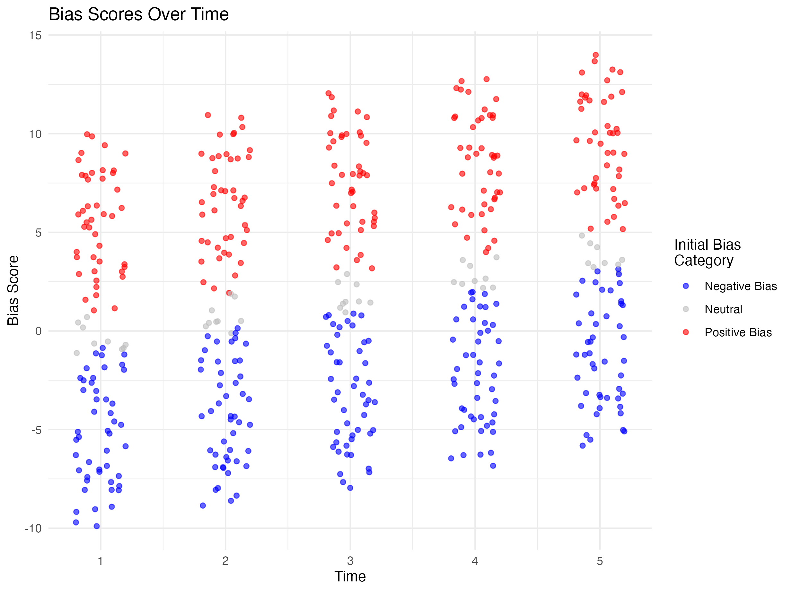

# saudi_YT

Repo for analyzing YT recommendations in Saudi Arabia

## Current Approach

1.  Obtain videos mentioning MBS.
2.  Extract the video id of each video mentioning MBS.
3.  Acquire related videos for each of these videos.
4.  Gather the transcripts and descriptions of these videos.

## TODO with current data to get channel-level bias scores

1.  Choose the channels returned from mbsrelatedvids.rds that appear at least 10 times (\~300 channels).
2.  Get information on every video from these channels (i.e., video_id, description etc.).
3.  Obtain the transcripts for all of these videos.
4.  Generate our embedding layer from the combined descriptions and/or transcripts of these videos.
5.  Project video descriptions/transcripts of MBS videos onto a positive-negative index (refer to this [paper](https://osf.io/68zn4/)) to get bias scores.

## TODO for getting related videos

6.  Assess whether the algorithm directs to more negative or more positive channels (in relation to MBS).
    -   This can be achieved by:
        -   Take 100 (or more if possible) seed videos about MBS from different channels for which we have bias scores.
        -   Query the API for related videos for each of the seed videos.
        -   Combine all of the video descriptions for the related videos for each seed video into one character string associated with that seed video.
        -   Induce seed-video-specific embedding for MBS by getting words around MBS and projecting onto the opposition-support vector in the reference embedding layer.
7.  We can then do the final analysis.
    -   For each seed video we have a channel-level bias score. So let's say we start on a pro-MBS channel seed video. We then have after carrying out the above:
        -   A seed video embedding based on all of the related videos for a seed video. So we can then look at direction of travel. If we start pro-MBS are the related videos similarly pro-MBS?
        -   We can also repeat this process iteratively and take the related videos of the related videos. Take all of those that mention MBS. Induce embedding, plot, go again. Repeat this 5-10 (more?) times?

This is the kind of thing I imagine (though not so nice looking) we might imagine seeing. Let's say for every video there is a positive direction of travel (whatever that means). We might end up with something like this.

You can find the code I used to simulate this in "99_example.R:"

## TODO Robustness Checks

1.  Use a VPN from Saudi and check for any differences.
2.  Compare between API related videos and user-related videos using a platform walkthrough qualitative approach.
    -   This is because, according to YouTube, the related videos endpoint doesn't necessarily reflect the actual related videos.
3.  Conduct the same search but for accounts with viewing histories.
    -   Uncertain if this is possible when using my Google account and associated OAuth.
